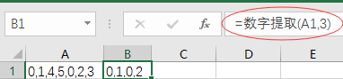

[Excel VBA 如何快速学习？](http://www.zhihu.com/question/20870802/answer/54998361)
----
2015-11-18
比如，你在Excel里面使用了VBA，那么Excel就是宿主。这个概念也适用于VBScript，对应的宿主可以认为是Windows本身（实际上是Windows的一个组件：Windows脚本宿主WSH）。
 
http://www.csidata.com/custserv/onlinehelp/vbsdocs/VBSTUTOR.HTM

https://msdn.microsoft.com/en-us/library/d1wf56tt(v=vs.84).aspx

```vb
Option Explicit

Dim app, wb, st
Dim row, col

Set app = WScript.CreateObject("Excel.Application")
app.Visible = True
Set wb = app.Workbooks.Add

Set st = wb.Worksheets(1)

For row = 1 To 10
    For col = 1 To 10
        st.Cells(row, col).Value = CInt(Int((100 * Rnd()) + 1))
    Next
Next
Set st = wb.Worksheets(2)
st.Range("A1:J10").Formula = "=int(rand()*100+1)"
```

开工作薄效率测试
----
用Workbooks.Open并没有比GetObject快~~
```vbs
Sub main()
    Call 程序初始化与反初始化(True)

    Dim fn As String
    Dim wb As Workbook
    Dim files As String: files = "\data\1\"
    
    fn = Dir(files & "*.xls")
    Do While fn <> ""
        Set wb = Workbooks.Open(files & fn, False, True)
        If Not (wb Is Nothing) Then wb.Close
        fn = Dir()
    Loop

    Call 程序初始化与反初始化(False)
End Sub
```

帮写提数字VBA 
----
2015/11/24
原理跟计算单词个数差不多


```vb
Function 数字提取(原内容 As String, 数值范围 As Long) As String
    Dim c As New Collection
    Dim d As Long
    Dim s As String
    
    For i = 1 To Len(原内容)
        s = Mid(原内容, i, 1)
        If s >= "0" And s <= "9" Then
            If d = -1 Then
                d = s - "0"
            Else
                d = d * 10 + (s - "0")
            End If
        Else
            If d <> -1 Then
                If d < 数值范围 Then c.Add d
                d = -1
            End If
        End If
    Next i
    If d <> -1 And d < 数值范围 Then c.Add d
    
    For Each cc In c
        数字提取 = 数字提取 & cc & ","
    Next cc
    数字提取 = Left(数字提取, Len(数字提取) - 1)
End Function
```

